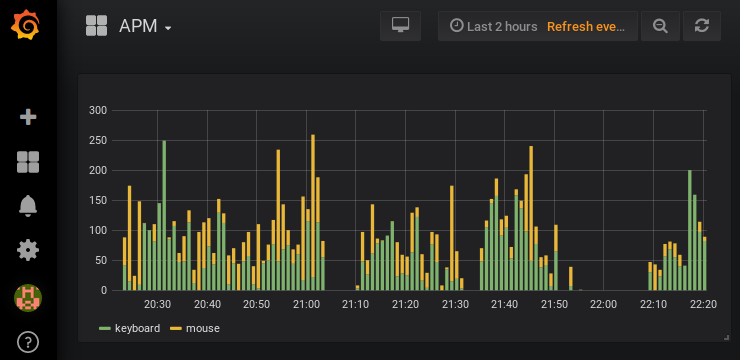

Inspired by StarCraft 2 Action per Minute (APM) counters [^1].



# Run
```
docker-compose up -d
python -mwebbrowser 'http://localhost:31337/d/apm/apm?refresh=10s&orgId=1&var-resolution=1m'
```


# Notes
- TimescaleDB setup
  - https://docs.timescale.com/v1.0/getting-started/setup
  - https://docs.timescale.com/v1.0/getting-started/configuring (ignored for now)
- Grafana
  - http://docs.grafana.org/features/datasources/postgres/#time-series-queries


# Development
```
ln -s env/dev/docker-compose.override.yml
```


[^1]: See the purple APM counter here: https://www.youtube.com/watch?v=kc_WFTDwWUg&t=1843s
